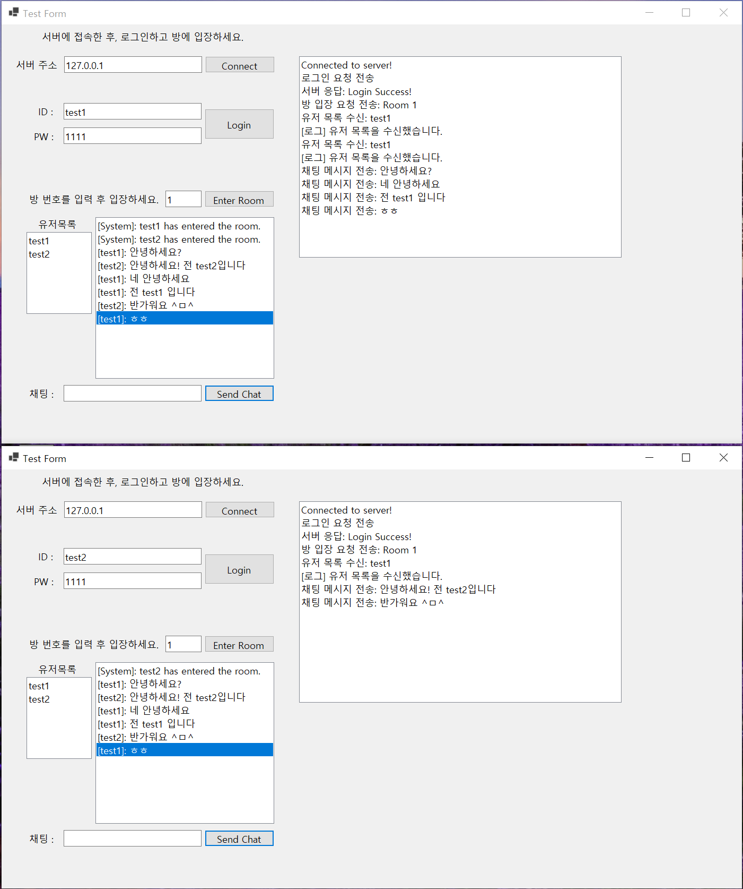

# ChatServerAcl

이 프로젝트는 Visual C++ 환경에서 오픈 소스 네트워크 프레임워크인 ACL(Advanced C/C++ Library)을 활용하여 구현한 채팅 서버입니다. <br>
이 서버는 코루틴을 이용한 비동기 처리, Redis를 활용한 사용자 인증, 그리고 C++과 C# 간의 직렬화된 데이터를 주고받는 기능을 포함합니다.
<br>
이 서버의 클라이언트는 [WinFormsClient 디렉토리](../WinFormsClient)에 존재합니다.

## 프로젝트 구조

```
ChatServerAcl/
├── main.cpp               # 프로젝트의 메인 엔트리 포인트로서 서버 구동 로직을 포함.
├── PacketDefinition.cpp   # 직렬화 및 역직렬화에 관한 패킷 정의 구현 파일.
├── PacketDefinition.h     # 패킷 정의와 관련된 클래스 및 구조체 선언 파일.
├── pch.h                  # 프로젝트에서 공통적으로 사용되는 헤더 파일들.
├── RoomManager.cpp        # 방 관리 및 사용자 메시지 브로드캐스트 로직 구현 파일.
├── RoomManager.h          # 방 관리 클래스 선언 파일.
├── tcpCoroutine.cpp       # TCP 코루틴 서버의 실행 로직 구현 파일.
└── tcpCoroutine.h         # TCP 코루틴 서버 관련 함수 및 클래스 선언 파일.
```

## 각 파일의 역할

### 1. `main.cpp`
- 이 파일은 서버의 진입점을 정의하고 있으며, 서버 구동 및 이벤트 루프를 설정하는 역할을 합니다.
- ACL 라이브러리와 코루틴을 활용하여 비동기 처리를 수행합니다.

### 2. `PacketDefinition.cpp` & `PacketDefinition.h`
- 이 파일들은 서버와 클라이언트 간 통신에 사용되는 패킷 구조를 정의하고, 패킷의 직렬화 및 역직렬화를 처리합니다. 
- 예를 들어, 로그인 요청, 방 입장 요청, 채팅 메시지 등을 직렬화된 바이너리 포맷으로 변환해 전송하거나, 수신된 데이터를 역직렬화해 해석하는 로직이 포함되어 있습니다.

### 3. `RoomManager.cpp` & `RoomManager.h`
- 이 파일들은 서버 내의 채팅방을 관리하는 로직을 구현합니다.
- 각 방에 사용자를 추가하거나 제거하고, 해당 방에 있는 모든 사용자에게 메시지를 브로드캐스트하는 기능을 제공합니다.

### 4. `tcpCoroutine.cpp` & `tcpCoroutine.h`
- 이 파일들은 서버의 TCP 연결 및 코루틴 처리 로직을 구현합니다.
- 코루틴을 활용해 여러 클라이언트와 비동기적으로 통신을 처리하며, 서버의 주 실행 흐름을 관리합니다.

### 5. `pch.h`
- 프로젝트에서 자주 사용되는 라이브러리나 헤더 파일들을 포함하는 프리컴파일 헤더 파일입니다.
- 이를 통해 컴파일 시간을 줄이고 코드의 일관성을 유지합니다.


## 주요 기능

### 1. Redis를 사용한 로그인
이 서버는 사용자 인증을 위해 Redis를 사용합니다. 사용자가 로그인 요청을 보내면 서버는 Redis 데이터베이스에서 해당 사용자의 ID/PW를 조회 후 인증합니다.

- **로그인 과정**:  
  1. 클라이언트가 `ReqLogin` 패킷을 서버로 전송합니다.  
  2. 서버는 Redis에서 사용자의 `UserID`를 조회하고, 저장된 비밀번호(`AuthToken`)와 클라이언트가 보낸 비밀번호를 비교합니다.  
  3. 일치할 경우 "Login Success!" 메시지를, 실패할 경우 "Login Failed!" 메시지를 클라이언트에 전송합니다.

```cpp
acl::string storedPassword;
bool userExists = cmd.get(loginRequest.UserID, storedPassword);

if (userExists && storedPassword == loginRequest.AuthToken) {
    std::string successMessage = "Login Success!";
    conn->write(successMessage.c_str(), successMessage.size());
} else {
    std::string failureMessage = "Login Failed!";
    conn->write(failureMessage.c_str(), failureMessage.size());
}
```

### 2. 채팅 기능
서버는 여러 사용자가 하나의 채팅방에 입장하여 서로 메시지를 주고받을 수 있는 기능을 제공합니다. 각 사용자가 보내는 메시지는 서버에서 받아 해당 방의 모든 사용자에게 브로드캐스트됩니다.

- **채팅 메시지 브로드캐스트**:  
  1. 사용자가 채팅방에 입장한 후, 클라이언트는 `ReqRoomChat` 패킷을 서버에 전송합니다.  
  2. 서버는 해당 메시지를 같은 방에 있는 모든 사용자에게 `NtfRoomChat` 패킷으로 브로드캐스트합니다. 
  
```cpp
void RoomManager::BroadcastMessage(int roomNumber, const std::string& message, const std::string& senderID) {
    RoomChatNotification notification;
    notification.TotalSize = sizeof(RoomChatNotification);
    notification.Id = PacketID::NtfRoomChat;
    std::strncpy(notification.UserID, senderID.c_str(), sizeof(notification.UserID) - 1);
    std::strncpy(notification.Message, message.c_str(), sizeof(notification.Message) - 1);

    char buffer[sizeof(RoomChatNotification)];
    notification.Serialize(buffer);
    Broadcast(roomNumber, buffer, sizeof(buffer));
}
```

### 3. C#과 C++ 사이의 패킷 직렬화 기법

이 프로젝트에서는 C++과 C# 간의 통신에서 패킷을 주고받기 위해 직접 구현한 **커스텀 직렬화** 방식을 사용합니다. <br>
이 방식은 사용자 정의된 간단한 직렬화 포맷을 통해 데이터를 처리하여 효율적으로 전송됩니다.

- **Protocol Buffer 소개**:  
 * [Protocol Buffers](https://protobuf.dev/)와 같은 오픈소스 데이터 직렬화 형식은 데이터를 효율적으로 인코딩하고, 여러 언어에서 쉽게 해석할 수 있도록 도와줍니다.
 * 하지만 이 프로젝트에서는 C++에서 직접 패킷 구조를 정의 후 직렬화하는 과정 학습을 위해 커스텀 직렬화 방식을 채택했습니다.

- **현재 구현 방식**:  
  각 패킷은 `Serialize` 및 `Deserialize` 함수를 통해 메모리 버퍼에 데이터를 기록하거나 읽습니다. 이 방식은 직관적이면서도 성능을 최적화할 수 있습니다.

  ```cpp
  // PacketDefinition.h
  struct PacketHeader {
      uint16_t TotalSize;
      PacketID Id;
      uint8_t Type;
  
      void Serialize(char* buffer) const;
      static PacketHeader Deserialize(const char* buffer);
  };
  
      .
      .
      .
  
  struct RoomChatRequest : public PacketHeader {
      char Message[256];
  
      RoomChatRequest() : PacketHeader() {
          std::memset(Message, 0, sizeof(Message));
      }
  
      void Serialize(char* buffer) const;
      static RoomChatRequest Deserialize(const char* buffer);
  };
  
  ```
  
  
  ```cpp
  // PacketDefinition.cpp
  void RoomChatRequest::Serialize(char* buffer) const {
      PacketHeader::Serialize(buffer);
      std::memcpy(buffer + sizeof(PacketHeader), Message, sizeof(Message));
  }
  
  RoomChatRequest RoomChatRequest::Deserialize(const char* buffer) {
      RoomChatRequest request{};
      request.TotalSize = *(uint16_t*)buffer;
      request.Id = *(PacketID*)(buffer + sizeof(request.TotalSize));
      request.Type = buffer[sizeof(request.TotalSize) + sizeof(request.Id)];
      std::memcpy(request.Message, buffer + sizeof(PacketHeader), sizeof(request.Message));
      return request;
  }
  ```

이와 같은 방식으로 패킷을 주고받으며, C++과 C# 간의 원활한 데이터 통신을 제공합니다.

## 실습 캡쳐

채팅 프로젝트의 실행 결과를 캡처한 화면입니다:

 


## 결론
이 프로젝트는 ACL 라이브러리를 활용하여 TCP 서버와 클라이언트 간의 채팅 시스템을 구축하는 실습 프로젝트입니다. <br>
주요 기능으로 Redis를 사용한 로그인 인증, 방을 관리하는 채팅 기능, C++과 C# 간의 커스텀 직렬화 방식을 구현하여 서버와 클라이언트 간의 원활한 통신을 실현합니다. <br>
