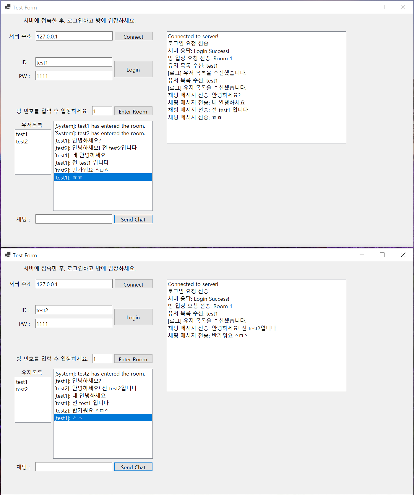

# CPP-Socket-acl

이 프로젝트는 Visual C++ 환경에서 오픈 소스 네트워크 프레임워크인 Acl(Advanced C/C++ Library)을 활용한 소켓 프로그래밍 학습을 목표로 하고 있습니다.

<br>

# 목차
1. [ACL 이란?](#acl-이란)
   - ACL 간단 소개
   - ACL 주요 기능 소개
   - 이 깃허브에서 다루는 실습 기능 소개

2. [ACL 빌드 및 정적 라이브러리로 추가하는 방법](#acl-빌드-및-정적-라이브러리로-추가하는-방법)

3. [ACL 기능 별 실습](#acl-기능-별-실습)
   - TCP Eco 서버 (TCP Eco Server + CppConsoleClient)
   - Coroutine을 사용한 TCP Eco 서버 (TCP Coroutine Eco Server + CppConsoleClient)
   - Redis 실습 (Redis Server Acl)
   - MySQL 실습 (Mysql Server Acl)
   - 동기화 객체 실습 (Sync Objects Acl)
   - HTTP Server 실습 (Http Acl)

4. [ACL 채팅 서버 실습 (with C# WinForms client)](#acl-채팅-서버-실습-with-c-winforms-client)
   - 실습 목표 소개
   - 주요 기능
      + Redis를 사용한 로그인
      + 채팅 기능
      + C#과 C++ 사이의 패킷 직렬화 기법
      + 동기화 객체
   - 실습 캡쳐

5. [C++23을 활용한 코드 리팩토링](#c23을-활용한-코드-리팩토링-정리)

6. [문서](#문서)
  
<br>

# ACL 이란?

[The Acl (Advanced C/C++ Library)](https://github.com/acl-dev/acl/tree/master)은 강력한 다중 플랫폼 네트워크 통신 라이브러리 및 서비스 프레임워크입니다.

지원되는 플랫폼: Linux, Windows, Solaris, FreeBSD, MacOS, iOS, AndroidOS

## ACL 주요 기능 소개
ACL 라이브러리에서 제공하는 주요 기능은 다음과 같습니다:

1. **Basic Network Module**
   - 가장 기본적인 스트리밍 통신 모듈로, 네트워크 스트리밍을 지원할 뿐만 아니라 파일 스트리밍도 지원

2. **Coroutine (코루틴)**
   - 비동기 코드를 작성할 수 있는 경량 스레드인 코루틴 지원
   - 이에 따라 lib_fiber는 다양한 동기화 객체 지원
     * Acl은 코루틴 및 멀티 스레드 기반의 프로그램에서 동기화 객체를 지원하여, 코루틴/스레드 간 상호 배제와 신호 전달을 안전하게 관리하여 프로그램의 안정성과 성능을 보장

3. **HTTP Module**
   - 고성능 HTTP 서버 및 클라이언트 구현 가능

4. **Redis Client**
   - Redis와의 상호작용을 위한 고성능 클라이언트 모듈 제공

5. **MQTT Module**
   - IoT 장치와의 통신을 위한 MQTT 모듈 제공

6. **Server Framework**
   - 다양한 서버 아키텍처를 위한 템플릿 및 기본 구조 제공

## 이 깃허브에서 다루는 실습 기능 소개

이 깃허브 프로젝트에서는 ACL을 사용하여 TCP 서버, HTTP 서버, 코루틴과 동기화 객체, DB(Redis, Mysql)과 같은 기능을 실습합니다. <br>
또한 채팅 서버 실습을 통해, C++에서 C# WinForms 클라이언트와의 통신도 구현합니다. <br>
   - TCP Eco 서버 (TCP Eco Server + CppConsoleClient) [🖱️click](./TCPEcoServerAcl)
   - Coroutine을 사용한 TCP Eco 서버 (TCP Coroutine Eco Server + CppConsoleClient) [🖱️click](./TCPCoroutineEcoServerAcl)
   - Redis 실습 (Redis Server Acl) [🖱️click](./RedisServerAcl)
   - MySQL 실습 (Mysql Server Acl) [🖱️click](./MySQLServerAcl)
   - 동기화 객체 실습 (Sync Objects Acl) [🖱️click](./SyncObjectsAcl)
   - HTTP Server 실습 (Http Acl) [🖱️click](./HttpAcl)
   - 채팅 서버 실습 (Chat Server Acl) [🖱️click](./ChatServerAcl)
<br>
그리고 C++23 버전을 지원하여, C++23의 다양한 기능을 도입하여 코드의 가독성, 성능, 유지 보수성을 개선했습니다.

<br> <br>

# ACL 빌드 및 정적 라이브러리로 추가하는 방법

## 1. ACL 빌드
1. 이 리포지토리의 [📁acl 디렉토리](./acl)로 이동합니다. 또는 [🖱️공식 깃허브](https://github.com/acl-dev/acl)를 clone 합니다.
2. 빌드를 진행하세요. **단, 자신의 프로젝트의 구성(Debug/Release)과 플랫폼(x64/x86)과 일치하도록**
   - windows 기준 : `acl_cpp_vc2022.sln` 솔루션에서 필요한 각 프로젝트의 빌드를 진행한다. <br>
      * lib_acl
      * lib_protocol
      * lib_acl_cpp
      * libfiber
      * libfiber_cpp
   - 빌드 방법에 대한 자세한 내용은 [📄Acl 빌드 후 정적 라이브러리로 추가하기](./Document/Build.md)를 참조하세요.
<br><br>

#### 만약 위의 과정을 생략하고 현재 나의 빌드 버전으로 테스트만 진행하고 싶다면,
현재 내 프로젝트에서 기본적으로 acl 라이브러리 세팅이 되어있기 때문에 테스트가 가능항 상황이다. <br> <br>

만약, 빌드에 문제가 있다면 아래 과정을 따라하자. <br>
이 리포지토리의 [📁acl/Debug_lib_Files 디렉토리](./acl/Debug_lib_Files) 에 빌드 파일이 위치하고 있다. <br>
따라서 추가로 빌드 과정을 거치고 싶지 않다면, [해당 위치(📁acl/Debug_lib_Files 디렉토리)](./acl/Debug_lib_Files)에 존재하는 .lib 파일들을 그대로 자신의 로컬 [📁acl/Debug 디렉토리](./acl/Debug)에 옮긴 후 <br>
아래 과정을 (경로까지 같게) 똑같이 따라하면 된다. <br>
하지만 학습을 위해 직접 빌드부터 라이브러리 추가까지의 과정을 경험하는 것을 추천한다. <br>

## 2. 정적 라이브러리 추가
- 구성관리자 > 구성/플랫폼 반드시 확인 (ex. Debug/x64)
- C/C++ > 일반 > **추가 포함 디렉터리**에 헤더파일 경로 추가
  + `..\acl\lib_fiber\c\include;..\acl\lib_fiber\cpp\include;..\acl\lib_acl_cpp\include;..\acl\lib_protocol\include;..\acl\lib_acl\include;..\acl\include;%(AdditionalIncludeDirectories)`
- 링커 > 일반 > **추가 라이브러리 디렉터리**에 lib 파일 경로 추가
  + `..\acl\Debug_lib_Files;%(AdditionalLibraryDirectories)` or `..\acl\Release_lib_Files;%(AdditionalLibraryDirectories)`
- 링커 > 입력 > **추가 종속성**에 lib파일 이름 추가
  + `lib_protocol.lib;lib_acl.lib;lib_acl_cpp.lib;libfiber.lib;libfiber_cpp.lib;$(CoreLibraryDependencies);%(AdditionalDependencies)`

<br>
정적 라이브러리를 Visual C++ 프로젝트에 추가하는 방법은 [📄친절한 정적 라이브러리 추가 방법](./Document/HowToAddCPPStaticLibrary.md)에 사진과 함께 설명되어 있습니다.

<br>

# ACL 기능 별 실습

## 1. TCP Eco Server + CppConsoleClient

이 실습은 기본적인 TCP Echo 서버와 C++로 구현된 간단한 콘솔 클라이언트를 다룹니다. 서버는 클라이언트로부터 받은 데이터를 그대로 돌려줍니다.

1. 서버 코드는 `TCPEcoServerAcl/` 디렉토리에 있습니다. [🖱️click](./TCPEcoServerAcl)
2. 클라이언트 코드는 `CppConsoleClient/` 디렉토리에 있습니다. [🖱️click](./CppConsoleClient)

## 2. TCP Coroutine Eco Server + CppConsoleClient

이 실습은 TCP Echo 서버를 코루틴 기반으로 확장합니다. 이 서버는 경량 코루틴을 사용하여 클라이언트와 비동기적으로 통신합니다.

1. 서버 코드는 `TCPCoroutineEcoServerAcl/` 디렉토리에 있습니다. [🖱️click](./TCPCoroutineEcoServerAcl)
2. 클라이언트 코드는 `CppConsoleClient/` 디렉토리에 있습니다. [🖱️click](./CppConsoleClient)

## 3. Redis

ACL을 사용하여 Redis와 상호작용하는 예제입니다. 이 예제는 Redis 클라이언트 모듈을 사용하여 데이터베이스와 통신합니다. <br>
Redis 연결 설정, 주요 자료형 실습(String, List, Set, Hash, Sorted Set), Redis JSON 사용 실습을 다루고 있습니다. <br>

1. Redis 코드는 `RedisServerAcl/` 디렉토리에 있습니다. [🖱️click](./RedisServerAcl)

## 4. MySql

ACL을 사용하여 MySql와 상호작용하는 예제입니다. 이 예제에서는 lib_acl을 통해 mysql 연결 및 쿼리문을 보다 편히 다루고 있습니다. <br>
MySQL 데이터베이스 연결 및 상호작용하여 데이터를 삽입, 조회, 업데이트 및 삭제하는 간단한 CRUD(Create, Read, Update, Delete) 작업을 수행하고 있습니다. <br>

1. MySql 코드는 `MySQLServerAcl/` 디렉토리에 있습니다. [🖱️click](./MySQLServerAcl)

## 5. Acl Synchronization Object

ACL이 제공하는 동기화 객체를 학습하는 예제입니다. 이 예제에서는 비동기 프로그래밍 및 코루틴 기반의 프로그램에서 사용할 수 있는 다양한 동기화 객체에 대해 학습합니다. <br>
코루틴이나 멀티스레드 환경에서 안정성과 자원 경합을 방지하기 위해 동기화 객체는 항상 필요합니다. <br>
구체적으로 아래와 같은 동기화 객체에 대해 다룹니다.

- fiber_mutex : 코루틴 전용 뮤텍스 객체
- fiber_lock : 일반적인 락 메커니즘을 제공하는 락 객체
- fiber_rwlock : 읽기-쓰기 락 객체
- fiber_sem : 세마포어 객체 (접근 가능한 코루틴 수 제한)
- fiber_event : 코루틴/스레드 간 신호를 전달하여 트리거하는 이벤트 객체
- fiber_cond : 특정 조건을 만족할 때까지 대기하는 코루틴을 깨우기 위해 사용하는 조건 변수 객체
- fiber_event_mutex : 코루틴 기반의 이벤트 뮤텍스 객체

1. Acl Synchronization Object 코드는 `SyncObjectsAcl/` 디렉토리에 있습니다. [🖱️click](./SyncObjectsAcl)


## 6. HTTP Server

Acl을 사용하여 구현한 HTTP Server입니다. 이 예제는 acl의 http module을 활용해 C++에서도 HTTP 서버 구현을 진행합니다. <br>
구체적으로 Acl의 fiber를 통한 비동기 http server의 구현에 대해 학습합니다.

1. Http Server 코드는 `HttpAcl/` 디렉토리에 있습니다. [🖱️click](./HttpAcl)


<br>

# ACL 채팅 서버 실습 (with C# WinForms client)

Acl이 제공하는 유용한 기능을 활용하여 C++ TCP 채팅 서버를 구현합니다. 이때 C# Winforms client와 통신합니다.

1. 서버 코드는 `ChatServerAcl/` 디렉토리에 있습니다. [🖱️click](./ChatServerAcl)
2. 클라이언트 코드는 `WinFormsClient/` 디렉토리에 있습니다. [🖱️click](./WinFormsClient)

## 실습 목표 소개

이 실습의 목표는 C++ ACL을 사용하여 TCP 채팅 서버를 구축하고, C# WinForms 기반의 클라이언트와 연동하는 것입니다. <br>
이 과정에서 Redis를 사용한 사용자 로그인, 채팅 메시지 처리, 패킷 직렬화 및 역직렬화 등의 개념을 다룹니다.

## 주요 기능

1. **Redis를 사용한 로그인**: 사용자 인증은 Redis 데이터베이스에서 관리됩니다. 사용자가 로그인하면 서버는 Redis에서 해당 사용자의 정보를 확인합니다.

2. **채팅 기능**: 여러 사용자가 채팅방에 입장하여 메시지를 주고받을 수 있습니다. 서버는 각 사용자의 메시지를 해당 방에 있는 모든 사용자에게 브로드캐스트합니다.

3. **C#과 C++ 사이의 패킷 직렬화 기법**
   - **Protocol Buffers**: [Protocol Buffers](https://protobuf.dev/)를 사용하여 C#과 C++ 간의 데이터 직렬화/역직렬화를 보다 쉽게 할 수 있습니다.
   - **현재 구현 방식**: 이 프로젝트에서는 Protocol Buffers 같은 오픈소스 직렬화 데이터 구조를 사용하지 않고, <br>
     직접 메모리 버퍼에 쓰고 읽는 식으로 구현한 직렬화 방식으로 패킷을 주고받습니다. <br>
     이는 사용자 정의된 간단한 직렬화 포맷을 사용하여 데이터를 처리합니다.

4. **동기화 객체**
   - 코루틴 사용 시 동기화 객체의 필요성 [📄동기화 객체란?](./Document/Cpp-SynchronizationObject.md)
   - Acl가 지원하는 동기화 객체 fiber_mutex 를 통해 코루틴/스레드 간 상호 배제와 신호 전달을 안전하게 관리하여 프로그램의 안정성과 성능을 보장
   - [📄lib_fiber가 지원하는 동기화 객체에 대한 설명](./Document/Cpp-SynchronizationObject.md)
   - [📄동기화 객체 fiber_mutex에 대한 설명](./Document/Coroutine-fiber_mutex.md)


## 실습 캡쳐

채팅 프로젝트의 실행 결과를 캡처한 화면입니다:

 

<br><br>

---

# C++23을 활용한 코드 리팩토링 정리

이번 프로젝트에서는 C++23의 최신 기능을 적용하여 코드를 리팩토링했습니다. 여기서는 사용된 주요 C++23 기능들을 기준으로 각각의 수정 사항을 명확하게 정리합니다.


## 1. **`std::print` 함수 사용**

**설명**:  
C++23에서 새롭게 도입된 `std::print` 함수는 서식화된 문자열 출력을 간결하게 처리할 수 있도록 도와줍니다. 기존의 `std::cout`을 대체하여 코드의 가독성과 유지 보수성을 높일 수 있습니다.

**변경 내용**:
- 기존의 `std::cout`과 `printf` 구문을 `std::print`로 대체하였습니다.
- 모든 출력 메시지의 서식을 일관되게 유지하였으며, 코드가 더 간결하고 명확해졌습니다.

**예시**:
- **변경 전**: 
  ```cpp
  std::cout << "Hello, World!" << std::endl;
  ```
- **변경 후**: 
  ```cpp
  std::print("Hello, World!\n");
  ```

<br>

## 2. **`std::string_view` 사용**

**설명**:  
`std::string_view`는 문자열을 복사하지 않고 참조할 수 있도록 설계된 C++ 표준 라이브러리 클래스입니다. 이를 통해 함수 인자로 전달되는 문자열에서 불필요한 메모리 복사를 방지하고, 성능을 최적화할 수 있습니다.

**변경 내용**:
- 기존의 `std::string` 참조 전달 방식을 `std::string_view`로 대체하여, 성능 최적화를 도모했습니다.
- 문자열을 읽기 전용으로 참조할 수 있게 함으로써 메모리 효율성을 높였습니다.

**예시**:
- **변경 전**: 
  ```cpp
  void set_value(const std::string& key, const std::string& value);
  ```
- **변경 후**: 
  ```cpp
  void set_value(std::string_view key, std::string_view value);
  ```


<br>


## 3. **`[[nodiscard]]` 속성 사용**

**설명**:  
`[[nodiscard]]` 속성은 함수의 반환 값을 무시하지 않도록 강제하는 기능입니다. 이를 통해 중요한 반환 값을 실수로 무시하는 것을 방지하여 코드의 안정성을 높일 수 있습니다.

**변경 내용**:
- 함수의 반환 값을 반드시 처리해야 하는 경우, `[[nodiscard]]` 속성을 추가했습니다.
- 이로 인해 반환 값을 실수로 무시하는 경우 컴파일러 경고가 발생하도록 하여, 코드 안정성을 강화했습니다.

**예시**:
- **변경 전**: 
  ```cpp
  bool is_connected();
  ```
- **변경 후**: 
  ```cpp
  [[nodiscard]] bool is_connected();
  ```

<br>


## 4. **범위 기반 `for` 루프 사용**

**설명**:  
범위 기반 `for` 루프는 컨테이너의 요소를 순회할 때 더욱 간결하고 직관적인 코드를 작성할 수 있게 해줍니다. 이는 코드 가독성을 높이고, 인덱스 관리의 복잡성을 줄여줍니다.

**변경 내용**:
- 기존의 인덱스 기반 반복문을 범위 기반 `for` 루프로 대체하여 코드의 간결성과 가독성을 개선했습니다.
- 불필요한 인덱스 변수를 줄임으로써 코드에서 발생할 수 있는 잠재적 오류를 방지했습니다.

**예시**:
- **변경 전**: 
  ```cpp
  for (size_t i = 0; i < container.size(); ++i) {
      process(container[i]);
  }
  ```
- **변경 후**: 
  ```cpp
  for (const auto& element : container) {
      process(element);
  }
  ```

---

## 5. **`std::map`과 `acl::string` 사용**

**설명**:  
`std::map`과 `acl::string`을 조합하여 Redis와 같은 외부 라이브러리와의 호환성을 유지하면서도 C++ 표준 라이브러리의 장점을 활용하였습니다.

**변경 내용**:
- Redis의 `zadd` 함수에 맞게 데이터를 전달하기 위해, `std::map<std::string, double>`과 `acl::string`을 적절히 조합하여 사용했습니다.
- 라이브러리 전용 문자열 클래스인 `acl::string`을 사용하여 Redis API와의 호환성을 유지하였습니다.

**예시**:
- **변경 전**: 
  ```cpp
  std::map<std::string, double> members;
  ```
- **변경 후**: 
  ```cpp
  std::map<acl::string, double> members;
  ```


---

<br>

# 문서

## 프로젝트 시작 이전
- [오픈소스 라이브러리(Acl 빌드 후) 정적 라이브러리로 추가 방법](./Document/Build.md)
- [친절한 정적 라이브러리 추가 방법](./Document/HowToAddCPPStaticLibrary.md)

## 개념 및 실습 예제
- [코루틴 설명 및 예제](./Document/Coroutine.md)
- [Acl HTTP 기능](./Document/Acl-HTTP-Server.md)
- [동기화 객체](./Document/Cpp-SynchronizationObject.md)
     + [코루틴 동기화 & fiber_mutex](./Document/Coroutine-fiber_mutex.md)
- [Redis 설명 및 예제](./Document/Redis.md)
    + [Redis 자주 사용하는 자료형](./Document/Acl-Redis-Data.md)
    + [Redis JSON](./Document/Acl-Redis-Json.md)
- [MySQL 설명 및 예제](./Document/MySQL-Acl.md)
- [예제 소스코드 (기본, 코루틴, DB)](./Document/EX.md)
- [코루틴 동기화](./Document/Coroutine-fiber_mutex.md)

## 원문 번역
- [예제 디렉토리 설명-번역](./Document/SAMPLES-KO.md)


## 추후 진행할 TODO
- [x] 기계 번역했던 문서 링크 걸기
- [ ] httpclient, redis 기능 사용했을 때 사용 안했을 때와 비교해서 메모리 사용량 차이. 프로그램 빌드 시작 때 확인
- [ ] httpclient, redis 기능을 사용했을 때 메모리릭은 없는지(아주 많은 횟수를 5~6시간 사용해보고)
- [ ] 파이버 사용 소켓 서버 성능 및 안정성(긴 시간 운용) 테스트
